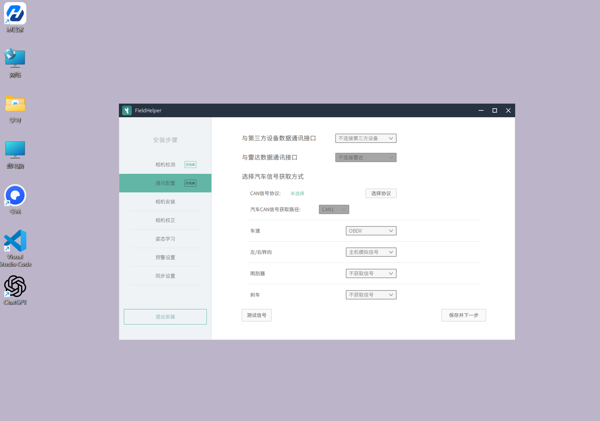
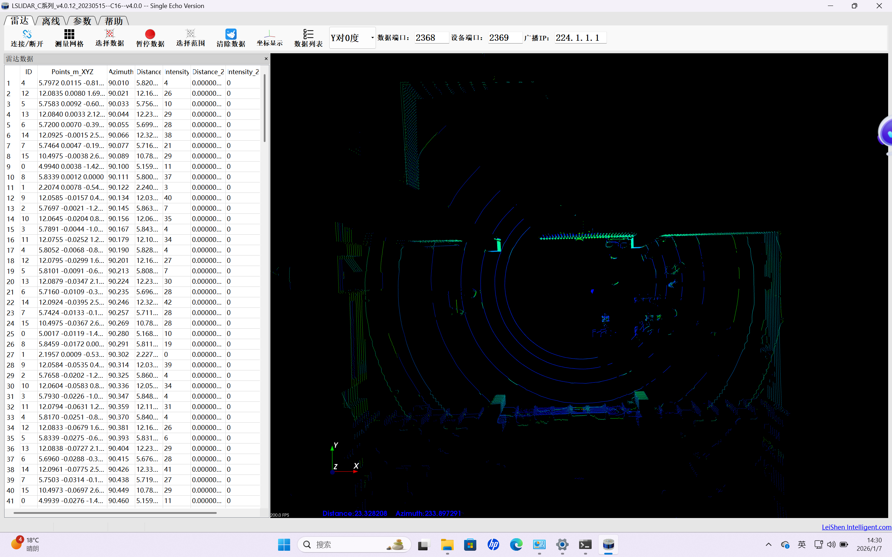
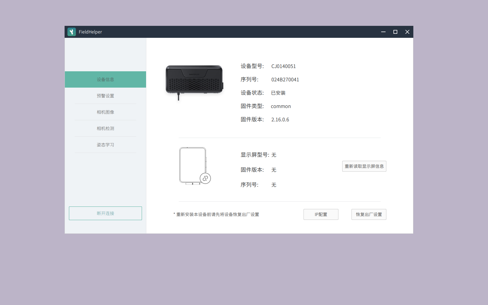
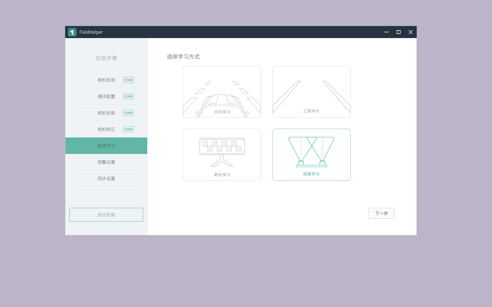
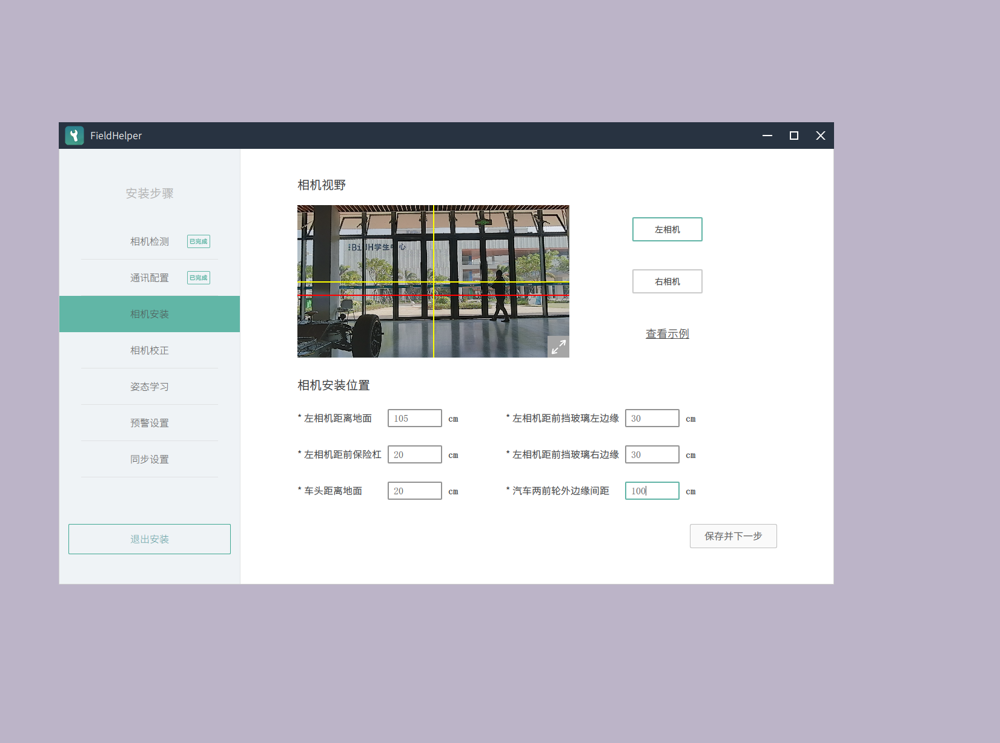
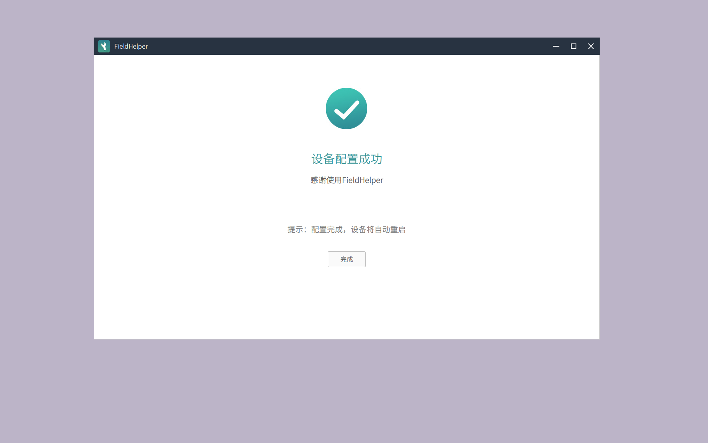

# Week7 实验报告

---

实验成功实现了基于 **Protobuf** 协议的传感器数据仿真，并通过 **Bazel** 构建系统重构了 Guardian 模块，最终实现了一个具备**滑动窗口滤波**能力的 AEB（自动紧急制动）闭环系统。

# 一、操作过程

## 第一阶段：环境启动（绕过网络超时）

1. **启动容器**（跳过联网检查）： 
    
    `cd /apollo
    sudo docker start apollo_dev`
    
2. **进入容器**：
    
    `bash docker/scripts/dev_into.sh`
    

---

## 第二阶段：任务 1 - 超声波雷达模块 (ultrasonic_sender)

要创建一个能模拟障碍物靠近并产生噪点的发送器。

1. **创建文件夹**： 
    
    `mkdir -p /apollo/modules/tools/ultrasonic_sender/proto`
    
2. **编写数据协议 (Proto)**：
    
    `cat << 'EOF' > /apollo/modules/tools/ultrasonic_sender/proto/ultrasonic.proto
    syntax = "proto2";
    package apollo.tools.ultrasonic;
    message Ultrasonic { optional double distance = 1; }
    EOF
    
    cat << 'EOF' > /apollo/modules/tools/ultrasonic_sender/proto/BUILD
    package(default_visibility = ["//visibility:public"])
    cc_proto_library(name = "ultrasonic_proto", deps = [":ultrasonic_proto_lib"])
    proto_library(name = "ultrasonic_proto_lib", srcs = ["ultrasonic.proto"])
    EOF`
    
3. **编写核心代码 (C++)**：使用标准 ROS 接口以确保稳定性。
    
    `cat << 'EOF' > /apollo/modules/tools/ultrasonic_sender/ultrasonic_sender.cc
    #include "ros/include/ros/ros.h"
    #include "std_msgs/Float64.h"
    #include "modules/common/log.h"
    
    int main(int argc, char** argv) {
      ros::init(argc, argv, "ultrasonic_sender");
      ros::NodeHandle nh;
      ros::Publisher pub = nh.advertise<std_msgs::Float64>("/apollo/sensor/ultrasonic_radar", 10);
      ros::Rate loop_rate(10);
      double dist = 10.0;
      while (ros::ok()) {
        dist -= 0.1;
        if (dist < 0) dist = 10.0;
        double send_val = (rand() % 15 == 0) ? 50.0 : dist; // 注入 50.0 噪点
        std_msgs::Float64 msg;
        msg.data = send_val;
        pub.publish(msg);
        AINFO << "Distance: " << send_val;
        ros::spinOnce();
        loop_rate.sleep();
      }
      return 0;
    }
    EOF`
    
4. **编写构建文件 (BUILD)**：
    
    `cat << 'EOF' > /apollo/modules/tools/ultrasonic_sender/BUILD
    package(default_visibility = ["//visibility:public"])
    cc_binary(
        name = "ultrasonic_sender",
        srcs = ["ultrasonic_sender.cc"],
        deps = ["//modules/common:log", "@ros//:ros_common"],
    )
    EOF`
    
    
    

---

## 第三阶段：任务 2 - Guardian 模块重构 (AEB 逻辑)

要实现：过滤 50.0 噪点 + 滑动窗口滤波 + 1.0m 自动刹车。

1. **彻底清理旧文件**（防止代码污染）： 
    
    `rm -f /apollo/modules/guardian/guardian.h /apollo/modules/guardian/guardian.cc /apollo/modules/guardian/BUILD`
    
2. **编写头文件 (h)**： 
    
    `cat << 'EOF' > /apollo/modules/guardian/guardian.h
    #ifndef MODULES_GUARDIAN_GUARDIAN_H_
    #define MODULES_GUARDIAN_GUARDIAN_H_
    #include <deque>
    #include "modules/guardian/proto/guardian.pb.h"
    #include "modules/control/proto/control_cmd.pb.h"
    #include "ros/include/ros/ros.h"
    #include "std_msgs/Float64.h"
    namespace apollo { namespace guardian {
    class Guardian {
     public:
      void Init();
      void OnUltrasonic(const std_msgs::Float64& message);
     private:
      ros::Subscriber sub_; ros::Publisher pub_;
      std::deque<double> window_;
    };
    }}
    #endif
    EOF`
    
3. **编写源文件 (cc)**：使用 gflags 实现动态调参。
    
    `cat << 'EOF' > /apollo/modules/guardian/guardian.cc
    #include "modules/guardian/guardian.h"
    #include "modules/common/log.h"
    #include "gflags/gflags.h"
    
    DEFINE_double(aeb_brake_value, 50.0, "brake value");
    
    namespace apollo { namespace guardian {
    void Guardian::Init() {
      ros::NodeHandle nh;
      sub_ = nh.subscribe("/apollo/sensor/ultrasonic_radar", 10, &Guardian::OnUltrasonic, this);
      pub_ = nh.advertise<apollo::guardian::GuardianCommand>("/apollo/guardian", 10);
    }
    void Guardian::OnUltrasonic(const std_msgs::Float64& msg) {
      if (msg.data < 20.0) { // 剔除 50.0 噪点
        window_.push_back(msg.data);
        if (window_.size() > 30) window_.pop_front();
      }
      if (window_.empty()) return;
      double sum = 0;
      for (double d : window_) sum += d;
      double avg = sum / window_.size();
      apollo::guardian::GuardianCommand g_cmd;
      if (avg < 1.0) { // AEB 逻辑
        g_cmd.mutable_control_command()->set_brake(FLAGS_aeb_brake_value);
        AINFO << "[AEB_LOG] TRIGGERED! Dist: " << avg << " Brake: " << FLAGS_aeb_brake_value;
      } else {
        g_cmd.mutable_control_command()->set_brake(0.0);
      }
      pub_.publish(g_cmd);
    }
    }}
    int main(int argc, char** argv) {
      google::ParseCommandLineFlags(&argc, &argv, true);
      ros::init(argc, argv, "guardian");
      apollo::guardian::Guardian node;
      node.Init();
      ros::spin();
      return 0;
    }
    EOF`
    
4. **编写构建文件 (BUILD)**：使用确定的库名 control_proto。 
    
    `cat << 'EOF' > /apollo/modules/guardian/BUILD
    package(default_visibility = ["//visibility:public"])
    cc_binary(
        name = "guardian",
        srcs = ["guardian.cc", "guardian.h"],
        deps = [
            "//modules/guardian/proto:guardian_proto",
            "//modules/control/proto:control_proto",
            "//modules/common:log",
            "@ros//:ros_common",
            "@com_github_gflags_gflags//:gflags",
        ],
    )
    EOF`
    

---

## 第四阶段：任务 3 - 运行与验证

需要同时开 **4 个终端**（每个都要 dev_into.sh）：

1. **终端 1：ROS 大脑**
    
    `roscore`
    
2. **终端 2：编译并跑雷达**
    
    `bazel build modules/tools/ultrasonic_sender:ultrasonic_sender
    ./bazel-bin/modules/tools/ultrasonic_sender/ultrasonic_sender`
    
    *看到 Distance 数字减小且有 50.0 跳出。*
    
    
    
3. **终端 3：编译并跑 Guardian** 
    
    `bazel build modules/guardian:guardian
    ./bazel-bin/modules/guardian/guardian --aeb_brake_value=95.0`
    
    
    
    *看到日志中显示 [AEB_LOG] TRIGGERED!。*
    
    
    
    
    
4. **终端 4：查看指令数据** 
    
    `rostopic echo /apollo/guardian`
    
    看到制动数值的画面
    
    
    

**在雷达发送端（右上窗口）出现 data: 50.0 噪点时，Guardian 日志（左下窗口）计算出的平均距离依然保持在 0.5x 左右平稳变动，证明了滑动窗口滤波器成功剔除了极值干扰。**

---

# 二、问题解决

### 一、 环境启动与 Docker 故障

**1. 问题：执行 dev_into.sh 提示容器未运行 (not running)。**

- **原因分析**：Apollo 的 Docker 容器在宿主机重启或长时间未操作后会自动进入停止状态。
- **解决方法**：使用 sudo docker ps -a 查找容器 ID，通过 sudo docker start [ID] 手动唤醒容器，而非直接运行 dev_start.sh（避免其联网检查更新导致卡顿）。

**2. 问题：dev_start.sh 启动时卡在 Pulling docker image 阶段。**

- **原因分析**：脚本默认联网检查镜像更新，由于 Docker Hub 官方镜像站在国内访问不稳定，导致连接超时。
- **解决方法**：手动执行 docker start apollo_dev 启动本地已存在的镜像，绕过联网检测。

---

### 二、 编译系统 (Bazel) 与依赖管理

**3. 问题：Bazel 编译报错 no such target 或 no such package。**

- **原因分析**：
    1. **路径错误**：在 modules/guardian 目录下运行了编译命令，而 Bazel 要求必须在项目根目录（/apollo）下执行。
    2. **名称不匹配**：不同版本的 Apollo 对 Proto 库的命名规则不一（如 control_cmd_proto 与 control_proto 的区别）。
- **解决方法**：
    1. 始终在根目录执行 bazel build。
    2. 利用 bazel query //modules/control/proto:all 指令动态查询系统数据库，确定当前版本中正确的依赖目标名称，并修正 BUILD 文件。

---

### 当距离小于 1.0 时，看到 brake: 95.0 的画面。三、 源代码编写与环境干扰

**4. 问题：Apollo 框架 (ApolloApp) 运行崩溃 Cannot open file guardian.flags。**

- **原因分析**：ApolloApp 框架对文件系统结构要求极高，启动时会强制寻找配置文件。在简易实验环境中，缺乏完整的配置路径会导致程序崩溃。
- **解决方法**：弃用复杂的 ApolloApp 框架，改用更轻量、通用的标准 ROS 编程模型（ros::init 与 ros::NodeHandle），提高了模块的独立性和容错率。

---

### 四、 ROS 通信与数据联动

**5. 问题：rostopic echo 报错 Unable to communicate with master。**

- **原因分析**：ROS 的核心组件 roscore 未启动，或者 echo 命令是在 Docker 容器外的宿主机上运行的。
- **解决方法**：确保在一个独立窗口运行 roscore，且所有数据观测操作必须在执行过 dev_into.sh 的终端内进行。

**6. 问题：echo 窗口没有数据跳动（空白）。**

- **原因分析**：Guardian 模块默认只在触发 AEB 条件（距离 < 1.0m）时才发送消息，导致安全状态下无法观测到数据。
- **解决方法**：临时将代码逻辑修改为 if (true) 强制发送，以验证话题链路是否通畅，并在验证完成后恢复正常的判定逻辑。

---

# 三、 实验总结

1. **分窗操作的重要性**：ROS 是分布式系统，发送端、处理端、观察端和 Master 必须各自占用独立终端，混用会导致逻辑冲突或无法观测。
2. **动态调参的优越性**：通过 gflags（命令行参数）修改刹车强度（如 --aeb_brake_value=95.0），极大减少了“修改代码-重新编译-运行”的重复劳动时间。
3. **理解滤波算法**：滑动窗口平均法能有效滤除单帧跳变的“野值”（噪点），在自动驾驶感知系统中是保证执行机构平顺性的关键。
4. **排错思维**：面对复杂的工程系统，应遵循“由内而外”的原则，先查底层容器，再查通信链路，最后调试代码逻辑。